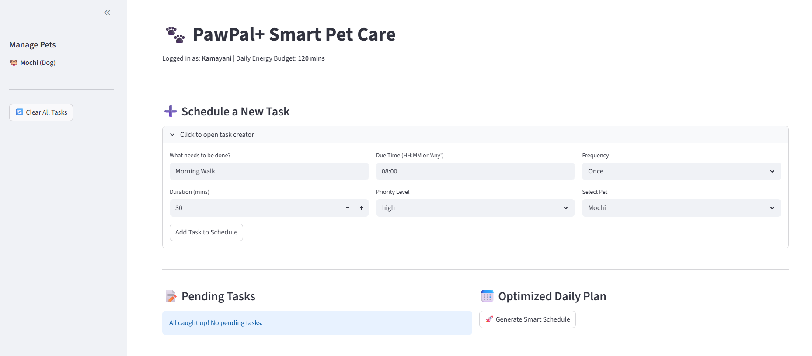
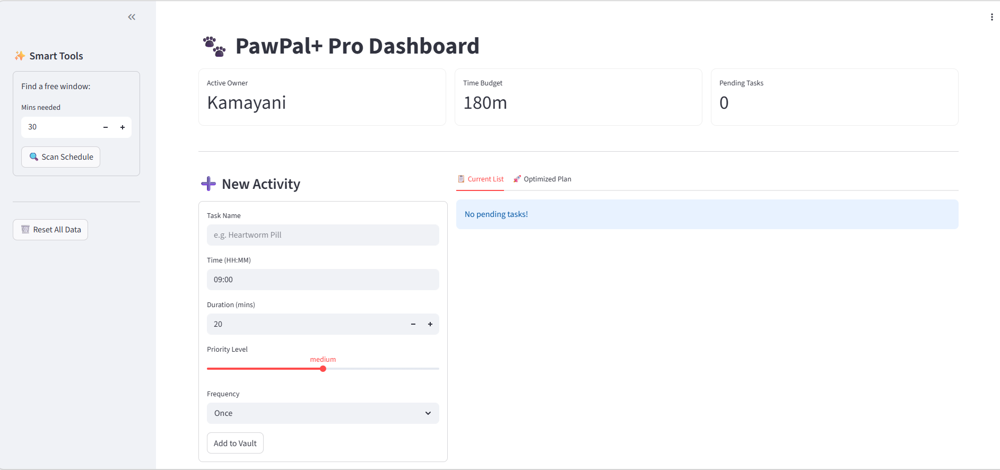

# PawPal+ (Module 2 Project)

You are building **PawPal+**, a Streamlit app that helps a pet owner plan care tasks for their pet.

## Scenario

A busy pet owner needs help staying consistent with pet care. They want an assistant that can:

- Track pet care tasks (walks, feeding, meds, enrichment, grooming, etc.)
- Consider constraints (time available, priority, owner preferences)
- Produce a daily plan and explain why it chose that plan

Your job is to design the system first (UML), then implement the logic in Python, then connect it to the Streamlit UI.

## What you will build

Your final app should:

- Let a user enter basic owner + pet info
- Let a user add/edit tasks (duration + priority at minimum)
- Generate a daily schedule/plan based on constraints and priorities
- Display the plan clearly (and ideally explain the reasoning)
- Include tests for the most important scheduling behaviors

## Smarter Scheduling (Phase 4 Additions)
PawPal+ now includes an intelligent backend engine capable of:
* **Time Sorting:** Automatically organizing the daily plan chronologically using multi-level sorting (Priority -> Shortest Duration -> Chronological).
* **Data Filtering:** Isolating tasks by specific pet or completion status using Pythonic list comprehensions.
* **Conflict Detection:** Preventing double-booking by calculating overlapping durations across all pets and returning lightweight warnings.
* **Recurring Task Automation:** Utilizing the `datetime` module to automatically spawn new future instances of daily or weekly tasks once completed.

## Testing PawPal+

To ensure the core scheduling engine runs flawlessly, this project includes an automated test suite built with `pytest`. 

To run the tests locally, use the following command in your terminal:
```bash
python -m pytest

## Getting started

### Setup

```bash
python -m venv .venv
source .venv/bin/activate  # Windows: .venv\Scripts\activate
pip install -r requirements.txt
```

### Suggested workflow

1. Read the scenario carefully and identify requirements and edge cases.
2. Draft a UML diagram (classes, attributes, methods, relationships).
3. Convert UML into Python class stubs (no logic yet).
4. Implement scheduling logic in small increments.
5. Add tests to verify key behaviors.
6. Connect your logic to the Streamlit UI in `app.py`.
7. Refine UML so it matches what you actually built.

---

## 📸 Demo

Take a look at the final PawPal+ interface in action:

<a href="pawpal_final_screenshot.png" target="_blank"></a>

*The dashboard showing the Smart Schedule, Task Creator, and live Conflict Detection warnings.*

---

### 🤖 Advanced Algorithm: Next Available Slot Finder
I implemented a "Slot Finder" algorithm that goes beyond basic scheduling by scanning the day for available gaps.

**Implementation Details via Agent Mode:**
* **The Goal:** Create a tool that helps users find "hidden" free time without manual calculation.
* **The Collaboration:** I used **Agent Mode** to brainstorm the logic. The AI suggested converting all tasks into a numerical timeline (minutes from midnight). 
* **The Refinement:** I modified the AI's initial suggestion to include an "Active Day" boundary (08:00 - 20:00). This ensures the assistant doesn't suggest tasks during late-night hours.
* **Result:** A robust backend method `find_next_available_slot()` that iterates through sorted busy blocks to find the first interval matching the user's required duration.

---

## 🤖 Advanced Capabilities (Agent Mode)

During the final iteration, I utilized **Agent Mode** to implement two significant architectural upgrades that go beyond basic scheduling.

### 1. Smart Gap Analysis (Slot Finder)
I implemented a "Next Available Slot" algorithm that scans the user's daily timeline to identify free windows.
* **Process:** I collaborated with the AI to transform a list of busy task objects into a linear timeline of minutes. 
* **Refinement:** While the AI initially suggested a simple search, I modified the logic to include "Active Day" boundaries (08:00 - 20:00) so that the system provides realistic suggestions for pet care.

### 2. Full Data Persistence (JSON)
To move from a transient session to a real-world application, I integrated local file storage.
* **The Strategy:** Since Python objects cannot be saved to JSON directly, I worked with Agent Mode to create a custom serialization/deserialization pattern.
* **Outcome:** The app now utilizes `save_to_json` and `load_from_json` methods. This ensures that all pets, tasks, and historical completions are remembered even after the Streamlit server is restarted.

---

### 🔴 Challenge: Weighted Priority Scheduling
I upgraded the core engine to support multi-level sorting, ensuring that the app acts as a smart triage system rather than just a calendar.

**Technical Implementation:**
* **Multi-Level Sort:** I modified the `Scheduler` to use a tuple-based sorting key. This ensures Python first sorts by the priority weight (High=0, Med=1, Low=2) and then by time.
* **Visual Triage:** I integrated a dynamic UI layer in Streamlit that uses color-coded alerts (`st.error` for High, `st.warning` for Medium) and emojis to give the user immediate visual feedback on the most critical tasks of the day.
* **Outcome:** The system can now handle "time poverty" situations—if the owner only has 60 minutes available, the app will automatically fill that time with High priority tasks first, even if they occur later in the day than Low priority ones.

---

### 🎨 Challenge 4: Professional UI & Readability
I transformed the application from a technical backend prototype into a professional-grade user interface focused on **Information Hierarchy**.

**Key UI/UX Features:**
* **Intelligent Iconography:** Implemented a keyword-based icon engine (`get_task_icon`) that automatically assigns emojis (💊 for meds, 🥣 for food) based on the task description, improving scannability.
* **Triage Color-Coding:** Used high-contrast status indicators (Red/Yellow/Blue) to separate critical medical tasks from routine activities, ensuring the user's attention is directed to the most important items first.
* **Metric Dashboards:** Integrated Streamlit `st.metric` components to provide a "Heads-Up Display" (HUD) of the user's current energy budget and pending workload.
* **Outcome:** The application now provides a "glanceable" experience where a pet owner can understand their entire daily plan in under 5 seconds.

---

## 📸 Demo (with Challenges)

Take a look at the final PawPal+ interface in action:

<a href="pawpal_final_screenshot1.png" target="_blank"></a>

